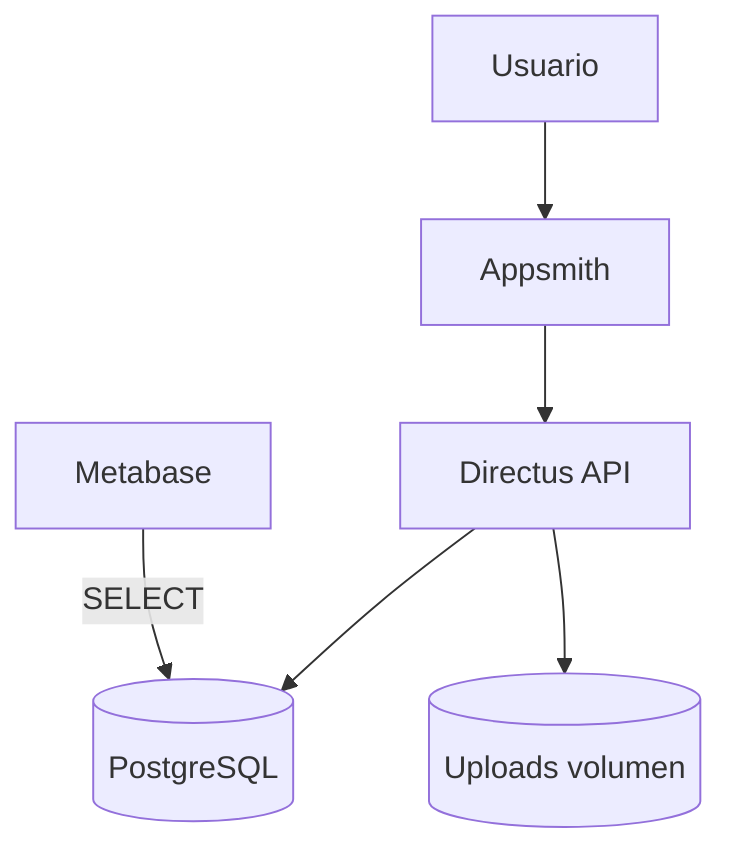
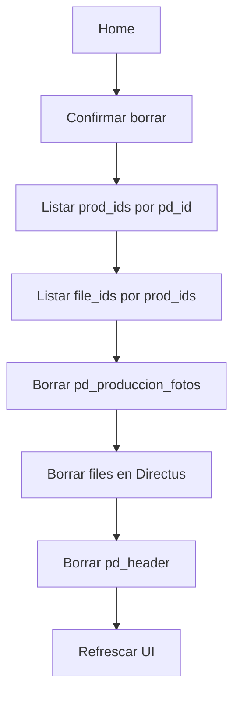

# SIGCO (MVP v1) — Resumen completo de decisiones y construcción (PostgreSQL + Directus + Appsmith + Metabase)

> Alcance: MVP operativo para **Parte Diario** (Header + Producción + HH + HM + Fotos), **borrado correcto con fotos**, **impresión/export PDF (simple)** y **dashboards/KPIs en Metabase**.  
> Enfoque: **simple, usable y escalable**.  
> Nota: Directus **no modela/expone “views” como colecciones** de la misma forma que tablas físicas (lo asumimos desde el principio). Las vistas son para **Metabase** y/o consumo SQL/BI.

---

## 1) Objetivo del MVP

Tener un circuito mínimo realista para obra:

- Crear/editar **Parte Diario** (Header).
- Cargar **Producción diaria** contra BOQ.
- Cargar **HH** (personal) y **HM** (equipos).
- Subir **múltiples fotos por tarea/producción** (registro fotográfico).
- Poder **imprimir/exportar** el Parte (vista “informe” sencilla, suficiente para MVP).
- Poder **borrar un Parte** desde Home y que borre **todo lo relacionado**, incluyendo **fotos** (Directus + vínculos).
- Preparar **vistas human-readable** (Postgres) y **KPIs en Metabase** (cuadro de comando).

Decisión operativa (MVP): **1 Parte Diario por día** (lo normal en obra).

---

## 2) Stack y servicios (Docker Compose)

Servicios activos:

- **PostgreSQL 16** (`erp_postgres`) — DB principal.
- **pgAdmin** (`erp_pgadmin`) — administración DB.
- **Directus 10.11** (`erp_directus`) — Auth, CRUD, API y Files.
- **Appsmith CE** (`erp_appsmith`) — UI operativa.
- **Metabase 0.49.12** (`erp_metabase`) — BI/visualización.
- (Opcional) **FastAPI** (`erp_api`) — no fue el foco de este tramo.

Puntos clave:
- Directus usa `STORAGE_LOCAL_ROOT=/directus/uploads` y volumen `./directus-uploads:/directus/uploads`.
- Directus persiste metadata de archivos en `public.directus_files`.

---

## 3) Modelo de datos (SIGCO)

### 3.1 Schemas
- `sigco`: operación (catálogos + movimientos diarios).
- `sigco_rpt`: reporting (vistas “human-readable” + KPIs para Metabase).

### 3.2 Tablas operativas principales

**Parte Diario**
- `sigco.pd_header` (PK: `pd_id`)
- `sigco.pd_produccion` (líneas de producción del parte)
- `sigco.pd_personal_hh`
- `sigco.pd_equipos_hm`

**Registro fotográfico**
- `sigco.pd_produccion_fotos`
  - `produccion_id` → referencia `sigco.pd_produccion.id_registro`
  - `file_id` → referencia `public.directus_files.id`

**Catálogos/BOQ**
- `sigco.boq_control` (base del BOQ: cantidad_base, unidad, área, familia, WBS, etc.)
- `sigco.cat_etapas` (con `orden` para definir “etapa final”)
- `sigco.cat_areas_frentes`, `sigco.cat_categorias_personal`, `sigco.cat_equipos`, etc.

Decisión importante (corrección real hecha):
- La columna correcta es **`familia_id`** (no `familia`) en BOQ.

---

## 4) Directus: cómo lo usamos en el MVP

Directus cumple 3 roles:

1) **Auth** (login/refresh) para Appsmith.
2) **CRUD/API** de las tablas de SIGCO (colecciones).
3) **Gestión de archivos** con `/files`:
   - metadata en `public.directus_files`
   - binarios en `/directus/uploads` (volumen docker)

Decisión: Files **no** se guardan en Postgres como bytea; se guardan en filesystem + metadata (más sano).

---

## 5) Appsmith: páginas, widgets y convenciones

Páginas:
- **Login**
- **Home** (tabla de partes, crear, borrar)
- **Parte** (header + producción + hh + hm + fotos)
- **PartePrint** (vista tipo “informe” para imprimir/guardar PDF)

Convenciones de queries:
- `SIGCO_*` → items SIGCO (pd_header, producción, hh, hm)
- `CAT_*` → catálogos
- `DX_*` → Directus Files (upload/list/delete)

Estado clave en store:
- `appsmith.store.current_pd_id` como **fuente de verdad** para el Parte actual.
- Evitamos inventar nuevas claves sin necesidad (esto fue un punto de fricción: se volvió a **current_pd_id**).

### 5.1 Nota crítica: Table Data en Appsmith (error recurrente)
En bindings de Table Data, Appsmith **no acepta** un bloque con `const` “suelto”.
Patrón correcto:

```js
{{
  (() => {
    const rows = PR_List_HH.data?.data || [];
    // maps, joins, etc.
    return rows.map(r => ({
      Persona: r.persona_nombre,
      Horas: r.horas
    }));
  })()
}}
````

---

## 6) Flujo de fotos y borrado correcto (lo más crítico)

### 6.1 Upload (múltiples fotos por producción)

Flujo implementado:

1. `POST /files` (multipart) → devuelve `file_id`.
2. Insert en `sigco.pd_produccion_fotos`:
    - `produccion_id`
    - `file_id`
    - opcional: `orden`, `descripcion`
3. Listado/preview en Appsmith (por `pd_id` trayendo fotos de todas las producciones del parte).
### 6.2 Problema real que pasó

Al borrar `pd_header` desde Home:
- Postgres borraba todo (header/producción/hh/hm/fotos-vínculo) **pero**
- Las imágenes seguían apareciendo en **Biblioteca de archivos de Directus**,
- y/o quedaban registros en `public.directus_files`.

Diagnóstico:
- **Borrar en Postgres no borra los archivos en Directus**.
- Además, si intentás borrar `directus_files` mientras sigue existiendo la FK desde `pd_produccion_fotos`, Directus devuelve error (violación FK).
### 6.3 Solución final (circuito correcto al presionar “Borrar Parte”)

Orden correcto:
1. Tomar `pd_id` desde `tblPartes.selectedRow.pd_id`
2. Listar `prod_ids` del parte:
    - `SIGCO_List_ProdIds_By_PD`
3. Listar `file_ids` de esas producciones:
    - `SIGCO_List_FileIds_By_ProdIds` (consulta a `pd_produccion_fotos`)
4. Borrar primero la tabla vínculo:
    - delete rows en `pd_produccion_fotos` para esos `file_id` o `prod_ids`
5. Borrar los archivos en Directus:
    - `DELETE /files/{id}` (uno por uno) **o** bulk si tu versión/endpoint lo soporta
6. Borrar `pd_header`:
    - cascada al resto (producción/hh/hm)

**Resultado:** al borrar el Parte desde Home, se borra **todo** incluyendo fotos (DB + storage).

---
## 7) Limpieza de huérfanos (archivos que quedaron “colgados”)

Objetivo: borrar imágenes/archivos que quedaron en Directus pero ya no están referenciados en SIGCO.

### 7.1 SQL para identificar huérfanos (DB)
```sql
SELECT f.id, f.filename_download, f.uploaded_on
FROM public.directus_files f
LEFT JOIN sigco.pd_produccion_fotos pf ON pf.file_id = f.id
WHERE pf.file_id IS NULL
ORDER BY f.uploaded_on DESC;
```

**Recomendación:** borrar “de verdad” por API (para asegurarte de borrar disco + metadata):
- `DELETE http://localhost:8055/files/{id}` con Bearer token.

---
## 8) Impresión / export PDF (MVP)

Decisión: ir por la opción más simple:

- Botón “Imprimir Parte” → navega a **PartePrint**.
- PartePrint renderiza en formato “informe”:
    - Header
    - Producción (human-readable)
    - HH detalle (human-readable)
    - HM detalle (human-readable)
    - Fotos: **galería simple/lista** (1 imagen por fila, todas las fotos del parte)

Notas:
- Se resolvió el tema de `window.print()` (en Appsmith a veces no está disponible como función directa).
- Para MVP, con que se vea “tipo informe” y se pueda imprimir/guardar PDF es suficiente.

---

## 9) Reporting: vistas `sigco_rpt` (human-readable + KPIs)

Se creó el schema `sigco_rpt` y estas vistas (ya aplicadas y funcionando):

- `sigco_rpt.v_pd_header`  
    Header + totales: `hh_total`, `hm_total`, `prod_lineas`, `fotos_total`
- `sigco_rpt.v_pd_produccion_det`  
    Producción detalle con BOQ + etapa + unidad + área + familia + WBS
- `sigco_rpt.v_pd_hh_det`  
    HH detalle con nombres de categoría y área
- `sigco_rpt.v_pd_hm_det`  
    HM detalle con nombres de equipo y área
- `sigco_rpt.v_pd_fotos_det`  
    Fotos detalle con metadata Directus
- `sigco_rpt.v_kpi_pd_resumen`  
    Resumen por parte (ideal para cards)
- `sigco_rpt.v_kpi_boq_avance`  
    Avance BOQ vs Real
- `sigco_rpt.v_kpi_diario`  
    Resumen por fecha (tendencias)
### 9.1 Decisión clave: Avance por “Etapa final” (Opción B)

Se definió y mantuvo:
- Avance BOQ vs real se calcula **solo por la etapa final** (la de mayor `orden` en `cat_etapas`).

Motivo:
- Evitar mezclar etapas intermedias (tendido/peinado/cosido/etc.) como si fueran “avance final”.
- Así el % avance se interpreta como **completitud real** (según tu criterio de “etapa final”).
---
## 10) Metabase: Dashboards (un dashboard con 3 tabs)

Decisión de acceso (MVP):
- **Acceso directo a Metabase :3000** (no embebido todavía).
- Las fotos no se muestran; solo contamos KPIs.

### 10.1 Dashboard único con tabs

Se armó un dashboard con 3 tabs:
#### Tab 1 — Operación Diaria
**KPIs (arriba):**
- Partes
- Líneas de producción
- HH total
- HM total

**Tendencias:**
- HH por día ✅
- HM por día ✅
- Líneas por día para “volumen de registro”; 

**Tabla:**
- Partes recientes ✅

Decisión explícita:
- **No** se agrega “Fotos por día” ni “Fotos total” como KPI central (poco valor para decisiones).

#### Tab 2 — Avance BOQ

**KPIs:**
- % Avance Promedio (Global) = avg(pct_avance)
- Items totales
- Items completos (saldo <= 0)
- Items pendientes (saldo > 0)

Justificación de “Items pendientes”:
- En proyectos grandes, saber **cuántos ítems** siguen abiertos es muy útil aunque tengan unidades distintas.
- Permite priorizar y ver “backlog del BOQ” sin caer en sumas absurdas.

Decisión explícita:
- NO usar “Saldo total global” (mezcla unidades: m, unid, etc. → no interpretable).

**Charts:**
- % avance promedio por área ✅ (bueno para detectar áreas trabadas)
- Pendientes por área (conteo de ítems pendientes por área) ✅  
    (reemplaza “saldo por área”, que mezcla unidades)

**Tabla accionable:**
- Top pendientes (BOQ) filtrado `saldo > 0`  
    Orden recomendado:
    - por `pct_avance` asc (más atrasados primero), o
    - por “cercanos a 0” si querés cerrar rápido (estrategia distinta)

#### Tab 3 — Recursos
Objetivo: consumo de recursos con cortes útiles.
- HH por Área (sum horas)
- HH por Categoría (sum horas; opcional breakout por Directo/Indirecto)
- HM por Equipo (sum horas_maquina)
- HM por Área (sum horas_maquina)

Decisión explícita:
- Evitar KPIs “cruzados” dudosos tipo:
    - HH / líneas de producción (depende de la definición de “línea” y mezcla trabajos)
    - fotos / línea (poco valor operativo)

---

## 11) KPIs: criterio para definirlos (herramienta mental)

Regla para aceptar/rechazar un KPI:
1. **¿Es comparable?**  
    Si mezcla unidades sin normalización → descartarlo (ej: saldo total).
2. **¿Qué decisión habilita?**
    - Pendientes (conteo) → priorización.
    - % avance por área → dónde atacar cuellos.
    - HH/HM por día → control de consumo y tendencia.
3. **¿Está alineado a la operación real?**  
    Un parte/día, etapa final como avance real.
4. **¿Es accionable?**  
    Tablas con filtros y orden ayudan más que un número que nadie interpreta.
	
---
## 12) Usuarios y acceso (Metabase)
Para MVP:
- Usuarios **nativos de Metabase** (no integrados con Directus todavía).
- Acceso directo: `http://<host>:3000`

Recomendación de seguridad mínima:
- Crear grupos:
    - `SIGCO_VIEWER` (solo lectura)
    - `SIGCO_ADMIN` (vos)
- Restringir DB permissions en Metabase:
    - Viewers solo `sigco_rpt` (ideal: no exponer `sigco` crudo).

Evolución futura (no MVP):
- Embedding en Appsmith o SSO (cuando haga falta).

---
## 13) Problemas reales que aparecieron y cómo se resolvieron
- Directus Files: “service unavailable” / multipart → se corrigió config y método de upload.
- Appsmith multipart: error “Expected array or object of multipart data” → corregido con FilePicker + formato correcto.
- Delete bulk en Directus: payload inválido / token / endpoint → se terminó usando el flujo correcto (borrar vínculos primero + borrar por id).
- Error FK al borrar `directus_files` → confirmación por logs (`fk_pd_prod_foto_file`).
- Appsmith Table data con `const` → resolver con IIFE.
- Confusión de variables: se volvió a “source of truth” `current_pd_id` (no inventar `print_pd_id` sin pipeline claro).
- Views: Directus no las muestra como colecciones (esto se asumió y se usa para Metabase).

---
## 14) Estado actual (Checkpoint)
✅ Appsmith:
- Login OK
- Home: lista/crea/borra parte OK (incluye fotos)
- Parte: header + producción + hh + hm + fotos OK
- PartePrint: informe simple imprimible OK (tablas legibles + galería simple)

✅ Directus:
- Archivos suben y se ven.
- Delete de parte elimina fotos correctamente (DB + storage).

✅ Postgres:
- `sigco_rpt` listo y con permisos SELECT para BI.

✅ Metabase:
- Colección SIGCO con cards
- Dashboard único con tabs (Operación Diaria / Avance BOQ / Recursos) funcionando

---
## 15) Próximos pasos (lo que seguía)

1. Consolidar “human-readable” en todas las tablas/consultas operativas (no solo en impresión).
2. Ajustar/curar KPIs (solo los que aportan decisión real).
3. (Opcional) Estándares de operación:
    - control de duplicados de partes por fecha (si hace falta)
    - permisos por rol (editor/solo lectura) en Appsmith/Directus
4. (Futuro) Embedding de Metabase o integración de auth (no MVP).

---
## Diagramas (Mermaid)
### Arquitectura



### Flujo borrar parte con fotos


