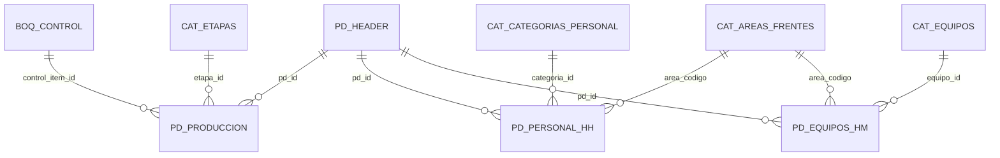

Perfecto. En términos de MVP, **ya estás en “Done” funcional**: login, Home/Parte, header editable, BOQ humano, producción/HH/HM CRUD, sumas HH/HM, delete parte con cascada, logout, app pública sin barra.
Lo que sigue ahora es **cerrar el MVP como entregable**: un README que deje el sistema operable, explicando:

- arquitectura (Docker + Directus + Appsmith + Postgres + opcionales)
- flujo de usuario
- modelo de datos (ERD)
- flujos (Mermaid)
- runbook (how-to: levantar, seeds, backups)
- permisos/roles y URLs
A continuación te dejo un **README.md completo** listo para copiar/pegar en tu repo.  
Incluye Mermaid **válido** (sin labels conflictivos).

# SIGCO — MVP v1 (Sistema de Gestión de Construcción y Obra)

MVP funcional para registrar **Partes Diarios** (header + producción + HH + HM) con:
- **PostgreSQL** como fuente de verdad (schema `sigco`)
- **Directus** como API/Backoffice (auth + permisos + CRUD)
- **Appsmith CE** como UI operativa para el usuario final (carga diaria)
- (Opcional) **Metabase** para BI/KPIs
- (Opcional) **pgAdmin** para administración DB

---

## 1) Arquitectura

### Componentes
- **Postgres 16**: persiste datos y aplica integridad referencial (FK + cascadas).
- **Directus**: administra colecciones, roles/permisos, autenticación, y expone REST.
- **Appsmith**: UI para carga del Parte (Login, Home, Parte) consumiendo Directus.
- **Metabase**: análisis y dashboards (opcional).
- **pgAdmin**: consola DB (opcional).

### Persistencia
La persistencia se logra por volúmenes Docker:
- `./pgdata` (Postgres)
- `./directus-data` y `./directus-uploads` (Directus)
- `./appsmith-stacks` (Appsmith)
- `./metabase-data` (Metabase)
- `./pgadmin-data` (pgAdmin)

---

## 2) URLs (LAN)

Ajustar IP según tu servidor.

- **Appsmith (app)**: `http://<IP>:8080/app/sigco`
- **Directus**: `http://<IP>:8055`
- **Metabase**: `http://<IP>:3000` (opcional)
- **pgAdmin**: `http://<IP>:8081` (opcional)

---

## 3) Roles y permisos (Directus)

Roles utilizados en MVP:
- **Planner**
- **Supervisor**
- **Consulta** (solo lectura)

Permisos clave:
- `pd_header`: READ/CREATE/UPDATE/DELETE (según rol)
- `pd_produccion`: READ/CREATE/DELETE (UPDATE opcional)
- `pd_personal_hh`: READ/CREATE/DELETE
- `pd_equipos_hm`: READ/CREATE/DELETE
- Catálogos (`cat_*`, `boq_control`, `wbs`): READ

Notas:
- El borrado de un Parte se realiza eliminando `pd_header`, y Postgres borra dependencias por **ON DELETE CASCADE**.

---

## 4) Flujo de usuario (Appsmith)

### Páginas
- **Login**: autentica contra Directus y guarda tokens.
- **Home**:
  - lista partes (`pd_header`)
  - crea nuevo parte (crea header)
  - abre parte seleccionado
  - borra parte seleccionado (cascada DB)
  - logout
- **Parte**:
  - carga header por `current_pd_id`
  - permite editar y guardar header
  - BOQ visible/humano + filtro
  - Producción: agregar/listar/eliminar
  - HH: agregar/listar/eliminar + suma
  - HM: agregar/listar/eliminar + suma
  - volver a Home

---

## 5) Diagramas (Mermaid)

### 5.1 Flujo UI MVP
```mermaid
flowchart TD
  L[Login] --> H[Home]
  H --> CP[Crear pd_header]
  CP --> P[Parte]
  H --> P[Parte]

  P --> GH[Get pd_header]
  GH --> UIH[Editar Header]
  UIH --> UH[PATCH pd_header]

  P --> BOQ[BOQ Listado + Filtro]
  BOQ --> PROD_ADD[Agregar Produccion]
  P --> PROD_LIST[Listar Produccion]
  P --> PROD_DEL[Eliminar Produccion]

  P --> HH_ADD[Agregar HH]
  P --> HH_LIST[Listar HH]
  P --> HH_DEL[Eliminar HH]
  P --> HH_SUM[Suma HH]

  P --> HM_ADD[Agregar HM]
  P --> HM_LIST[Listar HM]
  P --> HM_DEL[Eliminar HM]
  P --> HM_SUM[Suma HM]

  P --> H[Volver a Home]
  H --> DEL[Delete pd_header]
  DEL --> CAS[Cascade delete DB]
  CAS --> H
  H --> L[Logout]
````

### 5.2 Secuencia Login + Tokens

```mermaid
sequenceDiagram
  autonumber
  participant U as Usuario
  participant A as Appsmith
  participant D as Directus

  U->>A: Login (email + password)
  A->>D: POST /auth/login
  D-->>A: access_token + refresh_token + user
  A->>A: store(auth)

  U->>A: Navega Home/Parte
  A->>D: /items/* con Authorization Bearer access_token
  D-->>A: data

  A->>D: POST /auth/refresh (si expira)
  D-->>A: access_token nuevo
  A->>A: store(access_token)
```

### 5.3 ERD (modelo de datos MVP)



---

## 6) Decisiones técnicas principales
1. **Directus no soporta PK compuesta** en colecciones:  
    Se adoptó `id_registro` como PK en `pd_produccion` y un `UNIQUE(pd_id, control_item_id, etapa_id)` para garantizar unicidad lógica.
2. **Borrado del Parte completo**:  
    Se implementó borrado a nivel `pd_header` y Postgres borra dependencias con `ON DELETE CASCADE` en `pd_produccion`, `pd_personal_hh`, `pd_equipos_hm`.
3. **BOQ humano**:  
    Se usan `fields[]` para traer relaciones y luego se “aplana” en Appsmith para mostrar `descripcion`, `area_nombre`, `unidad_tipo`, `familia_nombre`, `wbs_nombre`.
4. **Defaults en UI sin pisar datos**:  
    Se ajustó ParteInit/Update para que el header no pierda defaults del widget y guarde valores reales.

---

## 7) Operación

### 7.1 Levantar stack
```bash
docker compose up -d
docker compose ps
```
### 7.2 Backup Postgres
```bash
docker exec -t erp_postgres pg_dump -U erp_user -d erp_db > backup_erp_db.sql
```
### 7.3 Restore Postgres

```bash
cat backup_erp_db.sql | docker exec -i erp_postgres psql -U erp_user -d erp_db
```
---
## 8) Checklist de cierre (MVP v1)
-  Login OK
-  Home: listar / crear / abrir OK
-  Parte: cargar header OK
-  Parte: guardar header (PATCH) OK
-  BOQ: lista humana + filtro OK
-  Producción: agregar/listar/eliminar OK
-  HH: agregar/listar/eliminar + suma OK
-  HM: agregar/listar/eliminar + suma OK
-  Home: borrar parte (cascada) OK
-  Logout OK

---
## 9) Próximos pasos sugeridos (post MVP)
- Estado del Parte: `borrador/cerrado` (bloquear edición al cerrar)
- Export diario (PDF) con formato cliente (Metabase o plantilla)
- Reporte semanal/mensual
- Auditoría (quién cargó qué) si se requiere contractual/legal

Si querés, en el siguiente paso lo hacemos “pro” para GitHub:
- agregamos un **diagrama de arquitectura** Mermaid (containers)
- agregamos un **índice** y una sección “Troubleshooting” (errores típicos: fields duplicados, filtro, permisos, refresh tokens)
- y un “How to” para crear usuarios/roles en Directus (paso a paso).
